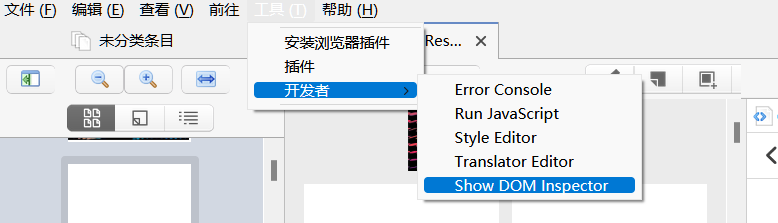

# Zotero DOM Inspector
Add [dom-inspector](https://github.com/luoye-fe/dom-inspector) to Zotero.


## Usage
- main menu
    - tools
        - developer
            - Show DOM Inspector



```js
const reader = Zotero.Reader.getByTabID(Zotero_Tabs.selectedID);
        
reader._iframeWindow.eval('inspector.disable()')  // pdf viewer
reader._window[3].eval('inspector.enable()')  // note editor
```
